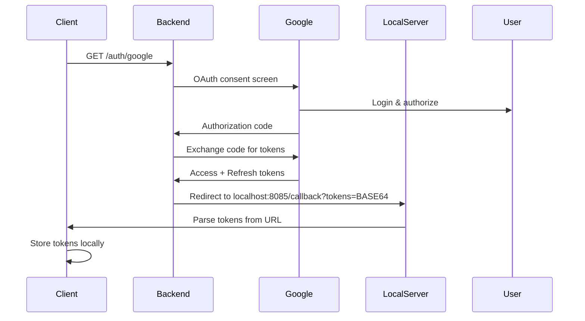

## Overview

StreamVault uses a backend server to handle Google OAuth securely. The client never sees OAuth client secrets - they remain on the server throughout the authentication flow.

## Why Backend OAuth?

Storing OAuth client secrets in a desktop application is insecure because:

- Secrets can be extracted from compiled binaries
- Decompiled apps expose credentials to anyone
- Client secrets must be kept confidential per OAuth 2.0 spec

By using a backend proxy, only access tokens reach the client.

## Authentication Flow



## Endpoints

### POST /auth/google

Initiates the OAuth 2.0 authorization flow.

**URL**: `https://streamvault-backend-server.onrender.com/auth/google`

**Method**: `GET` (browser redirect)

**Flow**:
1. Client opens this URL in system browser
2. User authenticates with Google
3. Backend exchanges authorization code for tokens
4. Backend redirects to `http://localhost:8085/callback?tokens=<BASE64_JSON>`

**Callback Format**:

```http
GET /callback?tokens=eyJhY2Nlc3NfdG9rZW4iOi4uLn0= HTTP/1.1
Host: localhost:8085
```

Tokens are base64-encoded JSON:

```json
{
  "access_token": "ya29.a0AfH6SMBx...",
  "refresh_token": "1//0gK8X9Y...",
  "expires_in": 3600,
  "token_type": "Bearer"
}
```

**Client Implementation** (gdrive.rs:686-688):

```rust
pub fn get_auth_url() -> String {
    format!("{}/auth/google", AUTH_SERVER_URL)
}
```

**Token Parsing** (gdrive.rs:691-748):

```rust
pub fn parse_tokens_from_callback(url: &str) -> Result<GoogleTokens, String> {
    let params: HashMap<&str, &str> = parse_query_string(url);
    
    let tokens_b64 = params.get("tokens")
        .ok_or("No tokens in callback URL")?;
    
    let tokens_json = base64::decode(tokens_b64)?;
    let token_data: serde_json::Value = serde_json::from_str(&tokens_json)?;
    
    Ok(GoogleTokens {
        access_token: token_data["access_token"].as_str()?.to_string(),
        refresh_token: token_data["refresh_token"].as_str().map(String::from),
        expires_at: Some(now() + token_data["expires_in"].as_i64()?),
        token_type: token_data["token_type"].as_str()?.to_string(),
    })
}
```

### POST /auth/refresh

Refreshes an expired access token using a refresh token.

**URL**: `https://streamvault-backend-server.onrender.com/auth/refresh`

**Method**: `POST`

**Request Body**:

```json
{
  "refresh_token": "1//0gK8X9Y..."
}
```

**Response** (200 OK):

```json
{
  "access_token": "ya29.a0AfH6SMBx...",
  "expires_in": 3600,
  "token_type": "Bearer"
}
```

**Error Response** (400/401):

```json
{
  "error": "invalid_grant",
  "error_description": "Token has been expired or revoked."
}
```

**Client Implementation** (gdrive.rs:130-167):

```rust
async fn refresh_access_token(&self, refresh_token: &str) -> Result<String, String> {
    let response = self.http_client
        .post(format!("{}/auth/refresh", AUTH_SERVER_URL))
        .json(&serde_json::json!({
            "refresh_token": refresh_token
        }))
        .send()
        .await?;

    if !response.status().is_success() {
        return Err(format!("Token refresh failed: {}", response.text().await?));
    }

    let token_response: serde_json::Value = response.json().await?;
    
    let access_token = token_response["access_token"]
        .as_str()
        .ok_or("Missing access_token")?;
    
    let expires_in = token_response["expires_in"].as_i64().unwrap_or(3600);
    let expires_at = chrono::Utc::now().timestamp() + expires_in;
    
    // Update stored tokens
    self.update_tokens(access_token, expires_at);
    
    Ok(access_token.to_string())
}
```

## Token Storage

Tokens are stored locally at:

**Windows**: `%APPDATA%/StreamVault/gdrive_tokens.json`
**Linux**: `~/.local/share/StreamVault/gdrive_tokens.json`
**macOS**: `~/Library/Application Support/StreamVault/gdrive_tokens.json`

**Format**:

```json
{
  "access_token": "ya29.a0AfH6SMBx...",
  "refresh_token": "1//0gK8X9Y...",
  "expires_at": 1735689600,
  "token_type": "Bearer"
}
```

## Token Lifecycle

### Automatic Refresh

Tokens are automatically refreshed when:

1. Access token is expired (checked before each API call)
2. Token expiration is within 60 seconds (gdrive.rs:115)

```rust
pub async fn get_access_token(&self) -> Result<String, String> {
    let tokens = self.tokens.lock().unwrap().clone();
    
    match tokens {
        Some(t) => {
            if let Some(expires_at) = t.expires_at {
                let now = chrono::Utc::now().timestamp();
                // Refresh if expired or expiring within 60 seconds
                if now >= expires_at - 60 {
                    if let Some(refresh_token) = &t.refresh_token {
                        return self.refresh_access_token(refresh_token).await;
                    }
                }
            }
            Ok(t.access_token)
        }
        None => Err("Not authenticated".to_string()),
    }
}
```

### Token Expiration

Google access tokens typically expire after **1 hour** (3600 seconds).

Refresh tokens:
- Do not expire automatically
- Can be revoked by user in Google Account settings
- Must be re-obtained if revoked

## Local Callback Server

The client runs a temporary HTTP server on port 8085 to capture the OAuth callback.

**Implementation** (gdrive.rs:752-815):

```rust
pub async fn wait_for_oauth_callback() -> Result<GoogleTokens, String> {
    let listener = TcpListener::bind("127.0.0.1:8085")
        .map_err(|e| format!("Failed to start OAuth callback server: {}", e))?;
    
    println!("[GDRIVE] OAuth callback server listening on port 8085");
    
    let (mut stream, _) = listener.accept()
        .map_err(|e| format!("Failed to accept OAuth callback: {}", e))?;
    
    let buf_reader = BufReader::new(&stream);
    let request_line = buf_reader.lines().next()
        .ok_or("No request received")?
        .map_err(|e| format!("Failed to read request: {}", e))?;
    
    let tokens = extract_tokens_from_request(&request_line)?;
    
    // Send success HTML response
    let response_body = r#"
        <!DOCTYPE html>
        <html>
        <head><title>Authorization Successful</title></head>
        <body>
            <h1>✓ Authorization Successful!</h1>
            <p>You can close this window and return to StreamVault.</p>
        </body>
        </html>
    "#;
    
    stream.write_all(format!(
        "HTTP/1.1 200 OK\r\nContent-Type: text/html\r\n\r\n{}",
        response_body
    ).as_bytes())?;
    
    Ok(tokens)
}
```

## Security Considerations

### What's Secure

- Client secrets never exposed to client
- Tokens transmitted via localhost (not exposed to network)
- Access tokens are short-lived (1 hour)
- Refresh tokens stored with file system permissions

### What's Not Secure

- Tokens stored in plaintext on disk
- No encryption at rest
- Local callback server uses HTTP (not HTTPS)

For production apps, consider:
- Encrypting token storage with OS keychain APIs
- Using a production OAuth redirect URI with HTTPS
- Implementing token encryption/obfuscation

## Error Handling

### Common Errors

**"No tokens in callback URL"**
- Backend failed to exchange authorization code
- User denied authorization
- Network error during OAuth flow

**"Token expired and no refresh token available"**
- Offline access not granted
- User revoked access in Google settings
- Re-authenticate required

**"Failed to refresh token"**
- Refresh token revoked
- Backend server unreachable
- Invalid refresh token

### Recovery

When token refresh fails, prompt user to re-authenticate:

```rust
if let Err(_) = client.get_access_token().await {
    // Clear invalid tokens
    client.clear_tokens()?;
    
    // Prompt re-authentication
    let auth_url = get_auth_url();
    open::that(&auth_url)?;
    
    // Wait for new tokens
    let tokens = wait_for_oauth_callback().await?;
    client.store_tokens(tokens)?;
}
```

## Testing

Test the authentication flow:

```rust
#[tokio::test]
async fn test_oauth_flow() {
    let client = GoogleDriveClient::new();
    
    // Open auth URL in browser
    let auth_url = get_auth_url();
    println!("Open this URL: {}", auth_url);
    
    // Wait for callback (blocks until user completes auth)
    let tokens = wait_for_oauth_callback().await.unwrap();
    
    // Store tokens
    client.store_tokens(tokens).unwrap();
    
    // Test API call
    let account = client.get_account_info().await.unwrap();
    println!("Logged in as: {}", account.email);
}
```

## Related

<CardGroup cols={2}>
  <Card title="Backend Overview" icon="server" href="/api/backend/overview">
    Backend architecture and self-hosting
  </Card>
  <Card title="Google Drive API" icon="google" href="/api/google-drive">
    Using authenticated Google Drive client
  </Card>
</CardGroup>