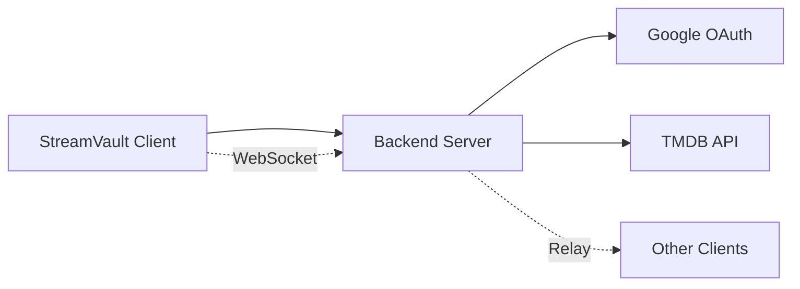

## Purpose

StreamVault uses a separate backend server to handle sensitive operations that cannot be safely performed client-side. The backend acts as a secure proxy for:

- **OAuth Authentication** - Keeps Google OAuth client secrets server-side
- **WebSocket Relay** - Coordinates Watch Together synchronized playback
- **TMDB Proxy** - Optional metadata API proxy

## Default Server

The official StreamVault backend is hosted at:

```
https://streamvault-backend-server.onrender.com
```

This server is used by default in production builds. In development mode, the client can connect to `localhost:3001` when running a local backend instance.

## Self-Hosting

You can run your own backend server for complete control over your data:

### Official Repository

```bash
git clone https://github.com/SlasshyOverhere/StreamVault-Backend
```

### Configuration

To use a custom backend, configure these environment variables before building:

```bash
# OAuth and social features
VITE_AUTH_SERVER_URL=https://your-backend-domain
STREAMVAULT_AUTH_SERVER_URL=https://your-backend-domain

# WebSocket server
STREAMVAULT_WS_URL=wss://your-backend-domain/ws/watchtogether

# Optional TMDB proxy
STREAMVAULT_TMDB_PROXY_URL=https://your-backend-domain/api/tmdb
```

See gdrive.rs:17 and watch_together.rs:12-20 for backend URL configuration.

## Architecture



### Security Model

**Client Secrets Stay Server-Side**: Google OAuth credentials never leave the backend. The client receives only access tokens via secure callback URLs.

**Token Exchange Flow**:
1. Client opens browser to `/auth/google` on backend
2. User authenticates with Google
3. Backend exchanges authorization code for tokens
4. Backend redirects to `http://localhost:8085/callback?tokens=BASE64_JSON`
5. Client extracts tokens from callback

## API Categories

### Authentication Endpoints

- `POST /auth/google` - Initiate OAuth flow
- `POST /auth/refresh` - Refresh access token

See [Authentication](/api/backend/authentication) for details.

### WebSocket Endpoints

- `WS /ws/watchtogether` - Watch Together room coordination

See [WebSocket Protocol](/api/backend/websocket) for message formats.

### TMDB Proxy (Optional)

- `GET /api/tmdb/*` - Proxy TMDB API requests

Used when client-side TMDB calls are blocked or rate-limited.

## Environment Detection

The client automatically selects the appropriate backend URL:

```rust
// gdrive.rs:17
const AUTH_SERVER_URL: &str = 
    "https://streamvault-backend-server.onrender.com";

// watch_together.rs:12-20
fn get_relay_server_url() -> String {
    std::env::var("STREAMVAULT_WS_URL")
        .unwrap_or_else(|_| {
            if cfg!(debug_assertions) {
                "ws://localhost:3001/ws/watchtogether".to_string()
            } else {
                "wss://streamvault-backend-server.onrender.com/ws/watchtogether"
            }
        })
}
```

## Development vs Production

| Environment | Auth Server | WebSocket Server |
|-------------|-------------|------------------|
| Development | `localhost:3001` (override) | `ws://localhost:3001/ws/watchtogether` |
| Production | `https://streamvault-backend-server.onrender.com` | `wss://streamvault-backend-server.onrender.com/ws/watchtogether` |

## Next Steps

<CardGroup cols={2}>
  <Card title="Authentication" icon="key" href="/api/backend/authentication">
    Learn about OAuth flow and token management
  </Card>
  <Card title="WebSocket Protocol" icon="wifi" href="/api/backend/websocket">
    Understand Watch Together synchronization
  </Card>
</CardGroup>