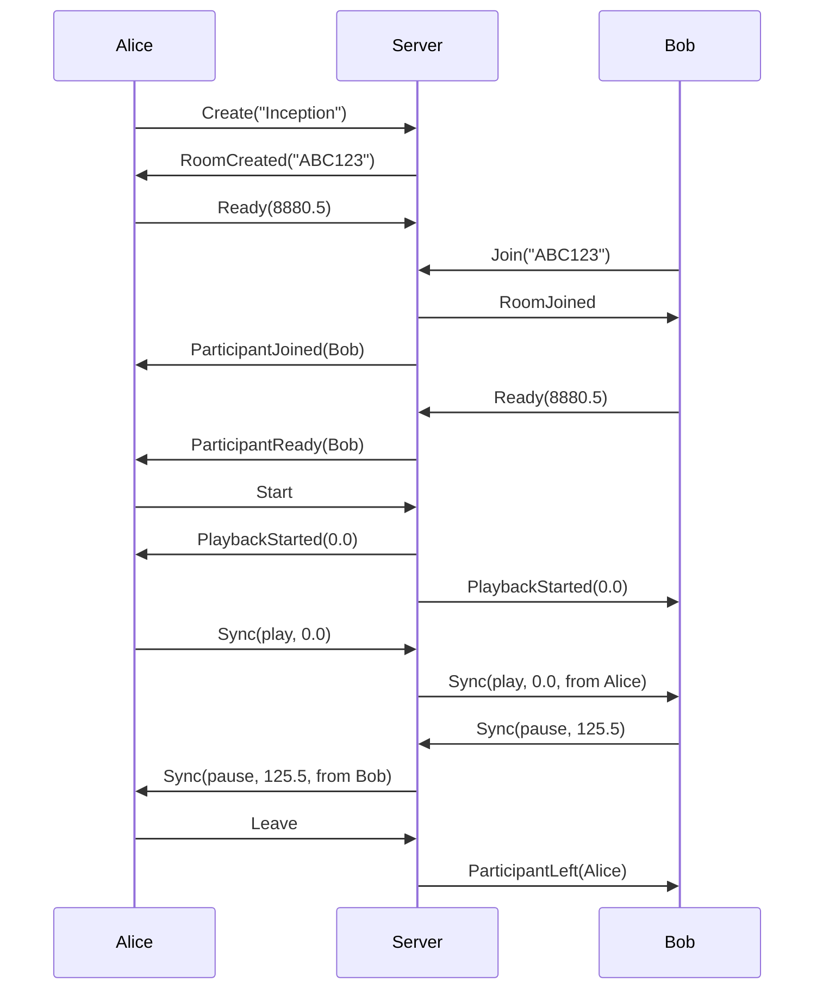

## Overview

StreamVault uses WebSocket connections to coordinate synchronized playback across multiple clients in Watch Together sessions. The backend acts as a relay server, forwarding sync commands and managing room state.

## Connection

### WebSocket URL

**Production**: `wss://streamvault-backend-server.onrender.com/ws/watchtogether`
**Development**: `ws://localhost:3001/ws/watchtogether`

### Connection Logic

The client automatically selects the appropriate WebSocket URL based on environment (watch_together.rs:12-21):

```rust
fn get_relay_server_url() -> String {
    std::env::var("STREAMVAULT_WS_URL")
        .unwrap_or_else(|_| {
            if cfg!(debug_assertions) {
                "ws://localhost:3001/ws/watchtogether".to_string()
            } else {
                "wss://streamvault-backend-server.onrender.com/ws/watchtogether"
            }
        })
}
```

### Establishing Connection

```rust
use tokio_tungstenite::connect_async;

let relay_url = get_relay_server_url();
let mut request = relay_url.into_client_request()?;

// Disable compression extensions
request.headers_mut().remove("Sec-WebSocket-Extensions");

let (ws_stream, _) = connect_async(request).await?;
let (mut write, mut read) = ws_stream.split();
```

## Room Lifecycle

### Creating a Room

Send `Create` message after connecting:

```json
{
  "type": "create",
  "media_title": "Inception (2010)",
  "media_id": 12345,
  "media_match_key": "inception_2010",
  "nickname": "Alice",
  "client_id": "550e8400-e29b-41d4-a716-446655440000"
}
```

**Server Response** (`room_created`):

```json
{
  "type": "room_created",
  "room": {
    "code": "ABC123",
    "host_id": "550e8400-e29b-41d4-a716-446655440000",
    "media_title": "Inception (2010)",
    "media_id": 12345,
    "participants": [
      {
        "id": "550e8400-e29b-41d4-a716-446655440000",
        "nickname": "Alice",
        "is_host": true,
        "is_ready": false,
        "duration": null
      }
    ],
    "is_playing": false,
    "state": "waiting",
    "current_position": 0.0
  }
}
```

**Room Code Format**: 6 uppercase alphanumeric characters (watch_together.rs:24-36):

```rust
const CODE_CHARS: &[u8] = b"ABCDEFGHJKLMNPQRSTUVWXYZ23456789";

pub fn generate_room_code() -> String {
    use rand::Rng;
    let mut rng = rand::thread_rng();
    (0..6)
        .map(|_| {
            let idx = rng.gen_range(0..CODE_CHARS.len());
            CODE_CHARS[idx] as char
        })
        .collect()
}
```

Ambiguous characters (I, 1, O, 0) are excluded to prevent confusion.

### Joining a Room

```json
{
  "type": "join",
  "room_code": "ABC123",
  "nickname": "Bob",
  "client_id": "7c9e6679-7425-40de-944b-e07fc1f90ae7",
  "media_id": 12345,
  "media_title": "Inception (2010)",
  "media_match_key": "inception_2010"
}
```

**Server Response** (`room_joined`):

```json
{
  "type": "room_joined",
  "room": {
    "code": "ABC123",
    "host_id": "550e8400-e29b-41d4-a716-446655440000",
    "media_title": "Inception (2010)",
    "media_id": 12345,
    "participants": [
      {
        "id": "550e8400-e29b-41d4-a716-446655440000",
        "nickname": "Alice",
        "is_host": true,
        "is_ready": true,
        "duration": 8880.5
      },
      {
        "id": "7c9e6679-7425-40de-944b-e07fc1f90ae7",
        "nickname": "Bob",
        "is_host": false,
        "is_ready": false,
        "duration": null
      }
    ],
    "is_playing": false,
    "current_position": 0.0
  }
}
```

**All Participants Notified** (`participant_joined`):

```json
{
  "type": "participant_joined",
  "participant": {
    "id": "7c9e6679-7425-40de-944b-e07fc1f90ae7",
    "nickname": "Bob",
    "is_host": false,
    "is_ready": false,
    "duration": null
  }
}
```

### Leaving a Room

```json
{
  "type": "leave"
}
```

**Server Response** (`participant_left`):

```json
{
  "type": "participant_left",
  "participant_id": "7c9e6679-7425-40de-944b-e07fc1f90ae7",
  "room": {
    "code": "ABC123",
    "participants": [
      {
        "id": "550e8400-e29b-41d4-a716-446655440000",
        "nickname": "Alice",
        "is_host": true,
        "is_ready": true
      }
    ]
  }
}
```

## Synchronization Protocol

### Ready State

Clients must signal when their player is loaded and ready:

```json
{
  "type": "ready",
  "duration": 8880.5
}
```

**Broadcast to All** (`participant_ready`):

```json
{
  "type": "participant_ready",
  "participant_id": "7c9e6679-7425-40de-944b-e07fc1f90ae7",
  "duration": 8880.5
}
```

### Starting Playback

Only the host can start synchronized playback:

```json
{
  "type": "start"
}
```

**Server Response** (`playback_started`):

```json
{
  "type": "playback_started",
  "position": 0.0
}
```

### Sync Commands

Participants send playback state changes:

**Play**:
```json
{
  "type": "sync",
  "command": {
    "action": "play",
    "position": 120.5
  }
}
```

**Pause**:
```json
{
  "type": "sync",
  "command": {
    "action": "pause",
    "position": 250.8
  }
}
```

**Seek**:
```json
{
  "type": "sync",
  "command": {
    "action": "seek",
    "position": 600.0
  }
}
```

**Broadcast to Others** (`sync`):

```json
{
  "type": "sync",
  "command": {
    "action": "play",
    "position": 120.5
  },
  "from": "Alice",
  "timestamp": 1735689600000,
  "is_echo": false
}
```

The `is_echo` flag indicates if this is the sender's own command reflected back (watch_together.rs:665-668):

```rust
ServerMessage::Sync { command, from, timestamp, is_echo } => {
    // Skip echo messages (our own sync commands reflected back)
    if is_echo {
        return;
    }
    emit(WatchEvent::SyncCommand { command }).await;
}
```

### State Reporting

Clients periodically report their playback state (every ~1 second):

```json
{
  "type": "state_report",
  "position": 125.3,
  "paused": false
}
```

**Server Authoritative Update** (`state_update`):

```json
{
  "type": "state_update",
  "position": 125.5,
  "paused": false,
  "server_time": 1735689600000,
  "your_rtt": 45.2,
  "participants": [
    {
      "id": "550e8400-e29b-41d4-a716-446655440000",
      "nickname": "Alice",
      "position": 125.5,
      "paused": false,
      "rtt": 45
    },
    {
      "id": "7c9e6679-7425-40de-944b-e07fc1f90ae7",
      "nickname": "Bob",
      "position": 125.4,
      "paused": false,
      "rtt": 62
    }
  ]
}
```

Clients use this to detect drift and resync if position differs significantly.

## RTT Measurement

### Ping-Pong Protocol

Clients measure round-trip time (RTT) by sending pings every 3 seconds (watch_together.rs:452-462):

**Client Ping**:
```json
{
  "type": "ping",
  "ping_id": "client-42"
}
```

**Server Pong**:
```json
{
  "type": "pong",
  "ping_id": "client-42",
  "server_time": 1735689600000,
  "your_rtt": 45.2
}
```

**Client RTT Report** (watch_together.rs:689-699):
```json
{
  "type": "pong_report",
  "ping_id": "client-42",
  "rtt": 45.2
}
```

The client calculates RTT locally and reports it back to the server for authoritative state tracking.

## Heartbeat

Keep-alive messages to detect disconnections:

**Client**:
```json
{
  "type": "heartbeat"
}
```

**Server**:
```json
{
  "type": "heartbeat_ack",
  "timestamp": 1735689600000
}
```

## Error Handling

### Server Errors

```json
{
  "type": "error",
  "message": "Room not found"
}
```

Common error messages:
- `"Room not found"` - Invalid room code
- `"Room is full"` - Maximum participants reached
- `"Media mismatch"` - Different media files
- `"Already in a room"` - Client already connected to another room

### Connection Loss

When the WebSocket closes, emit `disconnected` event (watch_together.rs:437-440):

```rust
Some(Ok(Message::Close(_))) | None => {
    if let Some(callback) = event_callback.lock().await.as_ref() {
        callback(WatchEvent::Disconnected);
    }
    break;
}
```

### Reconnection Strategy

The client does **not** automatically reconnect. Users must manually rejoin the room after disconnection.

To implement auto-reconnect:

```rust
loop {
    match connect_and_join().await {
        Ok(_) => break,
        Err(e) if e.contains("connection") => {
            tokio::time::sleep(Duration::from_secs(5)).await;
            continue;
        }
        Err(e) => return Err(e),
    }
}
```

## Message Type Reference

### Client → Server Messages

| Type | Purpose | Required Fields |
|------|---------|----------------|
| `create` | Create new room | `media_title`, `media_id`, `nickname`, `client_id` |
| `join` | Join existing room | `room_code`, `nickname`, `client_id`, `media_id` |
| `ready` | Signal player ready | `duration` |
| `start` | Start playback (host only) | None |
| `sync` | Send sync command | `command` |
| `leave` | Leave room | None |
| `heartbeat` | Keep-alive ping | None |
| `state_report` | Report playback state | `position`, `paused` |
| `ping` | RTT measurement | `ping_id` |
| `pong_report` | Report measured RTT | `ping_id`, `rtt` |

### Server → Client Messages

| Type | Purpose | Fields |
|------|---------|--------|
| `room_created` | Room created successfully | `room` |
| `room_joined` | Joined room successfully | `room` |
| `room_state` | Room state update | `room` |
| `participant_joined` | New participant joined | `participant` |
| `participant_left` | Participant left | `participant_id`, `room?` |
| `participant_ready` | Participant is ready | `participant_id`, `duration` |
| `playback_started` | Playback started | `position` |
| `sync` | Sync command from peer | `command`, `from`, `timestamp`, `is_echo` |
| `state_update` | Authoritative state | `position`, `paused`, `server_time`, `your_rtt`, `participants` |
| `ping` | Server ping for RTT | `ping_id`, `server_time` |
| `pong` | Server pong response | `ping_id`, `server_time`, `your_rtt` |
| `heartbeat_ack` | Heartbeat response | `timestamp` |
| `error` | Error occurred | `message` |

## Data Structures

### RoomInfo

```typescript
interface RoomInfo {
  code: string;              // 6-character room code
  host_id: string;           // UUID of host client
  media_title: string;       // Movie/episode title
  media_id: number;          // Database ID
  participants: Participant[];
  is_playing: boolean;       // Playback state
  state?: string;            // "waiting" | "playing" | "paused"
  current_position: number;  // Playback position (seconds)
}
```

### Participant

```typescript
interface Participant {
  id: string;           // UUID
  nickname: string;     // Display name
  is_host: boolean;
  is_ready: boolean;    // Has loaded media
  duration?: number;    // Media duration (seconds)
}
```

### SyncCommand

```typescript
interface SyncCommand {
  action: "play" | "pause" | "seek";
  position: number;       // Playback position (seconds)
  from?: string;          // Sender nickname
  timestamp?: number;     // Unix timestamp (milliseconds)
}
```

### ParticipantSyncInfo

```typescript
interface ParticipantSyncInfo {
  id: string;
  nickname: string;
  position: number;  // Current playback position
  paused: boolean;
  rtt: number;       // Round-trip time (milliseconds)
}
```

## Example Session



## Testing

Test WebSocket connection:

```rust
#[tokio::test]
async fn test_watch_together() {
    let manager = WatchTogetherManager::new();
    
    // Create room
    let room = manager.create_room(
        12345,
        "Inception (2010)".to_string(),
        Some("inception_2010".to_string()),
        "Alice".to_string(),
    ).await.unwrap();
    
    println!("Room created: {}", room.code);
    
    // Set ready
    manager.set_ready(8880.5).await.unwrap();
    
    // Start playback
    manager.start_playback().await.unwrap();
    
    // Send sync command
    manager.send_sync("play", 0.0).await.unwrap();
    
    // Leave room
    manager.leave_room().await.unwrap();
}
```

## Related

<CardGroup cols={2}>
  <Card title="Backend Overview" icon="server" href="/api/backend/overview">
    Backend architecture and deployment
  </Card>
  <Card title="Watch Together" icon="users" href="/features/watch-together">
    Using Watch Together feature
  </Card>
</CardGroup>