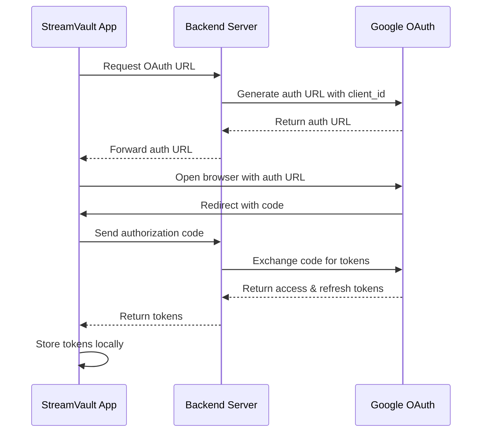

## Overview

StreamVault integrates with Google Drive to:
- Index your entire cloud media library
- Stream videos directly without downloading
- Monitor for new content in real-time (5-second polling)
- Cache frequently watched content locally

<Note>
Google Drive integration uses **OAuth 2.0** authentication handled securely by the StreamVault backend server.
</Note>

## OAuth Flow Architecture

The authentication process uses a **backend proxy** to protect OAuth credentials:



### Why Use a Backend Server?

From `gdrive.rs:14-17`:

```rust
// Backend auth server URL (handles OAuth securely)
// This keeps client_id and client_secret on the server
const AUTH_SERVER_URL: &str = "https://streamvault-backend-server.onrender.com";
```

<Warning>
**Security**: Never embed OAuth `client_secret` in desktop apps! The backend proxy prevents secret exposure while maintaining secure authentication.
</Warning>

## Connecting Google Drive

<Steps>
  <Step title="Open Settings">
    Click the **Settings** gear icon → **Cloud Storage** section
  </Step>
  
  <Step title="Click Connect">
    Click **Connect Google Drive** button
  </Step>
  
  <Step title="Browser Opens Automatically">
    StreamVault opens your default browser to Google's OAuth consent screen
  </Step>
  
  <Step title="Sign In to Google">
    - Select or sign in to your Google account
    - Review the permissions StreamVault is requesting
  </Step>
  
  <Step title="Grant Permissions">
    Click **Allow** to grant StreamVault:
    - Read access to your Google Drive files (`drive.readonly` scope)
    - Basic profile information (email, name)
  </Step>
  
  <Step title="Automatic Redirect">
    After authorization:
    - **Production**: Redirects to `https://indexer-oauth-callback.vercel.app/`
    - **Development**: Redirects to `http://localhost:8085/callback`
    
    The redirect page automatically sends the auth code back to StreamVault
  </Step>
  
  <Step title="Confirmation">
    You'll see a success toast:
    ```
    Connected!
    Signed in as user@gmail.com
    ```
  </Step>
</Steps>

## Connection UI Implementation

From `GoogleDriveSettings.tsx:49-80`:

```tsx
const handleConnect = async () => {
  setIsConnecting(true)
  try {
    // Start OAuth - this opens the browser
    await startGDriveAuth()

    toast({
      title: "Authorization Started",
      description: "Complete sign-in in your browser. You'll be redirected back automatically."
    })

    // Wait for the OAuth callback (automatic via deep link or localhost)
    const info = await completeGDriveAuth()

    setIsConnected(true)
    setAccountInfo(info)

    toast({
      title: "Connected!",
      description: `Signed in as ${info.email}`
    })
  } catch (error) {
    console.error('[GDrive] Auth failed:', error)
    toast({
      title: "Connection Failed",
      description: String(error),
      variant: "destructive"
    })
  } finally {
    setIsConnecting(false)
  }
}
```

## OAuth Scopes

StreamVault requests these Google API scopes:

| Scope | Purpose |
|-------|----------|
| `https://www.googleapis.com/auth/drive.readonly` | Read-only access to Drive files (default) |
| `https://www.googleapis.com/auth/drive` | Full access (required for delete operations) |
| `https://www.googleapis.com/auth/userinfo.email` | User email address |
| `https://www.googleapis.com/auth/userinfo.profile` | User profile information |

<Note>
By default, StreamVault uses **read-only** scope (`drive.readonly`). Full access is only requested when you use delete operations.
</Note>

## Re-Authentication for Delete Permissions

When you delete media from StreamVault that needs to be removed from Drive:

<Steps>
  <Step title="Initial Scope Change">
    StreamVault detects it needs the `drive` scope (not just `drive.readonly`)
  </Step>
  
  <Step title="Automatic Re-Auth Prompt">
    The app prompts you to re-authenticate with the new scope
  </Step>
  
  <Step title="Grant Additional Permission">
    Google's consent screen shows:
    - ✓ See and download all your Google Drive files
    - ✓ **Delete files and folders in your Google Drive** (new)
  </Step>
  
  <Step title="Updated Token">
    After granting permission, StreamVault receives a new access token with the expanded scope
  </Step>
</Steps>

## Token Refresh

Access tokens expire after **1 hour**. StreamVault automatically refreshes them using the refresh token.

From `gdrive.rs:106-127`:

```rust
pub async fn get_access_token(&self) -> Result<String, String> {
    let tokens = self.tokens.lock().unwrap().clone();

    match tokens {
        Some(t) => {
            // Check if token is expired
            if let Some(expires_at) = t.expires_at {
                let now = chrono::Utc::now().timestamp();
                if now >= expires_at - 60 {
                    // Token expired or about to expire, refresh it
                    if let Some(refresh_token) = &t.refresh_token {
                        return self.refresh_access_token(refresh_token).await;
                    }
                    return Err("Token expired and no refresh token available".to_string());
                }
            }
            Ok(t.access_token)
        }
        None => Err("Not authenticated".to_string()),
    }
}
```

### Refresh Flow

From `gdrive.rs:130-167`:

```rust
async fn refresh_access_token(&self, refresh_token: &str) -> Result<String, String> {
    let response = self.http_client
        .post(format!("{}/auth/refresh", AUTH_SERVER_URL))
        .json(&serde_json::json!({
            "refresh_token": refresh_token
        }))
        .send()
        .await
        .map_err(|e| format!("Failed to refresh token: {}", e))?;

    let token_response: serde_json::Value = response.json().await?;

    let access_token = token_response["access_token"]
        .as_str()
        .ok_or("Missing access_token in response")?
        .to_string();

    let expires_in = token_response["expires_in"].as_i64().unwrap_or(3600);
    let expires_at = chrono::Utc::now().timestamp() + expires_in;

    // Update stored tokens
    let mut tokens = self.tokens.lock().unwrap();
    if let Some(ref mut t) = *tokens {
        t.access_token = access_token.clone();
        t.expires_at = Some(expires_at);
        save_tokens(t).ok();
    }

    Ok(access_token)
}
```

<Note>
Refresh tokens are **long-lived** (valid until revoked). StreamVault stores them securely in `%APPDATA%/StreamVault/gdrive_tokens.json`.
</Note>

## Disconnecting Google Drive

From `GoogleDriveSettings.tsx:82-103`:

```tsx
const handleDisconnect = async () => {
  setIsDisconnecting(true)
  try {
    await disconnectGDrive()
    setIsConnected(false)
    setAccountInfo(null)

    toast({
      title: "Disconnected",
      description: "Google Drive has been disconnected"
    })
  } catch (error) {
    console.error('[GDrive] Disconnect failed:', error)
    toast({
      title: "Error",
      description: "Failed to disconnect",
      variant: "destructive"
    })
  } finally {
    setIsDisconnecting(false)
  }
}
```

<Warning>
**Data Retention**: Disconnecting Google Drive removes tokens but **does not delete** your local database or cached media. To fully reset, use Settings → Advanced → Reset Application.
</Warning>

## Account Information Display

After connecting, StreamVault displays:

- **Email**: Google account email address
- **Storage Used**: Current Drive storage usage
- **Storage Limit**: Total Drive storage quota
- **Storage Bar**: Visual progress indicator

From `GoogleDriveSettings.tsx:150-177`:

```tsx
{isConnected && accountInfo && (
  <div className="space-y-3">
    {/* Account Info */}
    <div className="flex items-center gap-2">
      <User className="w-4 h-4" />
      <span>{accountInfo.email}</span>
    </div>

    {/* Storage Info */}
    <div className="space-y-2">
      <div className="flex items-center gap-2">
        <HardDrive className="w-4 h-4" />
        <span>
          {formatStorageSize(accountInfo.storage_used)} of{' '}
          {formatStorageSize(accountInfo.storage_limit)} used
        </span>
      </div>
      <div className="h-2 rounded-full bg-muted overflow-hidden">
        <div
          className="h-full bg-gradient-to-r from-white to-gray-400"
          style={{ width: `${Math.min(100, (storage_used / storage_limit) * 100)}%` }}
        />
      </div>
    </div>
  </div>
)}
```

## Indexing Your Drive

After connecting:

<Steps>
  <Step title="Open Sidebar">
    Navigate to the **Cloud** tab in the sidebar
  </Step>
  
  <Step title="Click Index Drive">
    Click the **Index Drive** button to scan your entire Google Drive
  </Step>
  
  <Step title="Monitor Progress">
    Watch the progress indicator as StreamVault:
    - Scans all folders recursively
    - Identifies movie and TV show files
    - Fetches metadata from TMDB
    - Downloads posters and thumbnails
  </Step>
  
  <Step title="View Library">
    Your indexed media appears in the **Movies** and **TV Shows** tabs
  </Step>
</Steps>

<Note>
Indexing is **incremental** - only new files not already in the database are processed.
</Note>

## Real-Time Change Detection

StreamVault monitors Google Drive for changes every **5 seconds** using the Changes API.

From `config.rs:194-208`:

```rust
// Cloud auto-scan interval in minutes (default 5 minutes)
#[serde(default = "default_cloud_scan_interval_minutes")]
pub cloud_scan_interval_minutes: u32,

fn default_cloud_scan_interval_minutes() -> u32 {
    5 // Scan every 5 minutes by default
}
```

### How It Works

1. **Initial Scan**: Gets a `startPageToken` from Google Drive Changes API
2. **Store Token**: Saves token in SQLite database
3. **Poll for Changes**: Every 5 seconds, requests changes since last token
4. **Process New Files**: Indexes newly added videos
5. **Update Token**: Updates stored token for next poll

<Note>
Change detection runs **even when minimized to system tray**. You'll receive Windows notifications when new media is added.
</Note>

## Environment Variables

For self-hosting or forking the backend, configure these in `.env.example:66-78`:

```bash
# Your Google OAuth 2.0 Client ID
# Example: 123456789-abcdefghijklmnop.apps.googleusercontent.com
GDRIVE_CLIENT_ID=YOUR_CLIENT_ID.apps.googleusercontent.com

# Your Google OAuth 2.0 Client Secret
# Example: GOCSPX-abcdefghijklmnop123456
GDRIVE_CLIENT_SECRET=YOUR_CLIENT_SECRET

# OAuth Redirect URI (optional - has sensible defaults)
# Default in production: https://indexer-oauth-callback.vercel.app/
# Default in development: http://localhost:8085/callback
GDRIVE_REDIRECT_URI=https://indexer-oauth-callback.vercel.app/
```

## Troubleshooting

<AccordionGroup>
  <Accordion title="Browser Doesn't Open">
    - Check if your default browser is set correctly
    - Try copying the OAuth URL from the console and opening it manually
    - Ensure firewall isn't blocking localhost:8085 (dev mode)
  </Accordion>
  
  <Accordion title="Authentication Failed">
    - Verify backend server is online: https://streamvault-backend-server.onrender.com
    - Check OAuth redirect URIs in Google Cloud Console
    - Clear stored tokens: Settings → Advanced → Reset Application
  </Accordion>
  
  <Accordion title="Token Expired">
    StreamVault automatically refreshes tokens. If this fails:
    - Disconnect and reconnect Google Drive
    - Check internet connectivity
    - Verify refresh token wasn't revoked in Google Account settings
  </Accordion>
  
  <Accordion title="Indexing Hangs">
    - Check Google Drive API quota (not exceeded)
    - Ensure TMDB API key is configured
    - Monitor Developer Console for errors
    - Try indexing a smaller folder first
  </Accordion>
</AccordionGroup>

## Next Steps

<CardGroup cols={2}>
  <Card title="TMDB Setup" icon="key" href="/configuration/tmdb-setup">
    Configure TMDB API for metadata
  </Card>
  <Card title="Player Setup" icon="play" href="/configuration/player-setup">
    Install MPV for playback
  </Card>
  <Card title="Cloud Streaming" icon="cloud" href="/features/cloud-streaming">
    Start streaming from Drive
  </Card>
  <Card title="Library Management" icon="folders" href="/features/library-management">
    Organize your media library
  </Card>
</CardGroup>